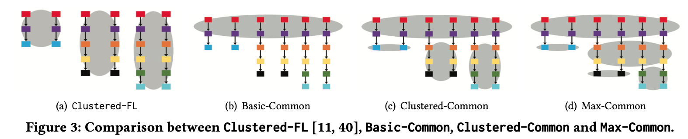
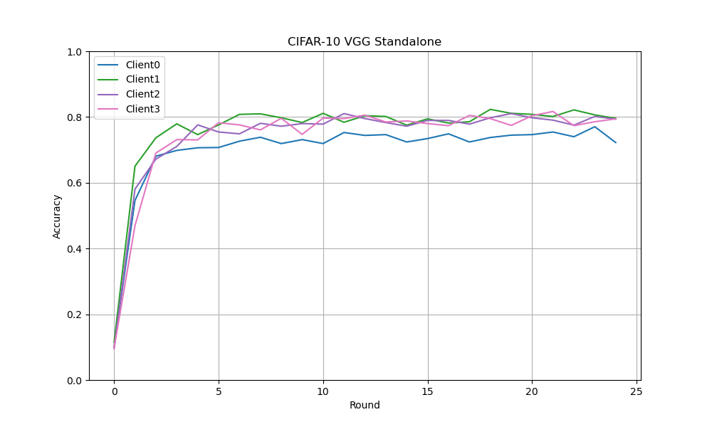
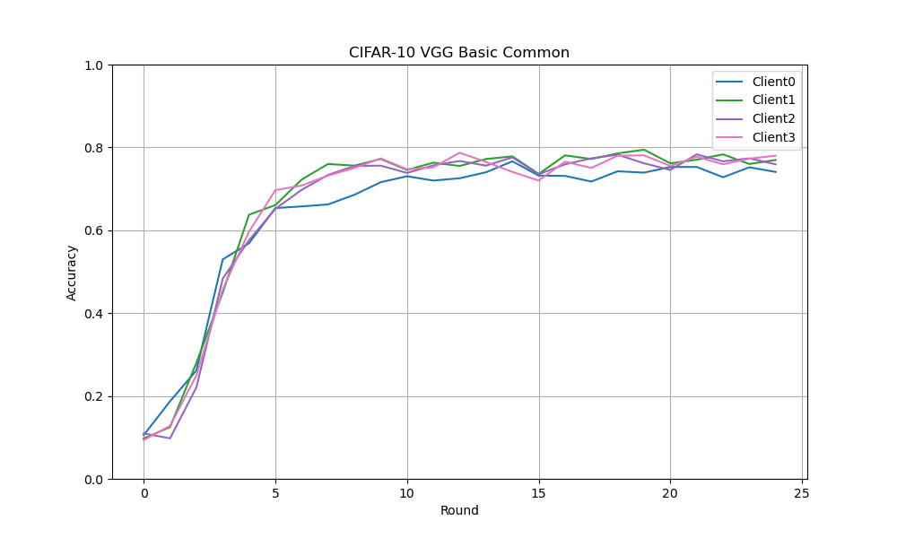
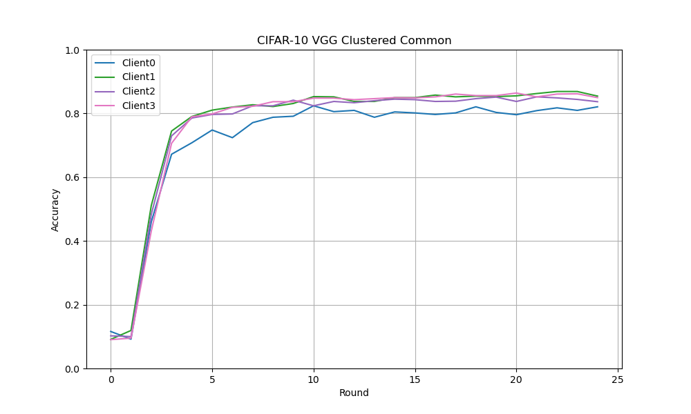
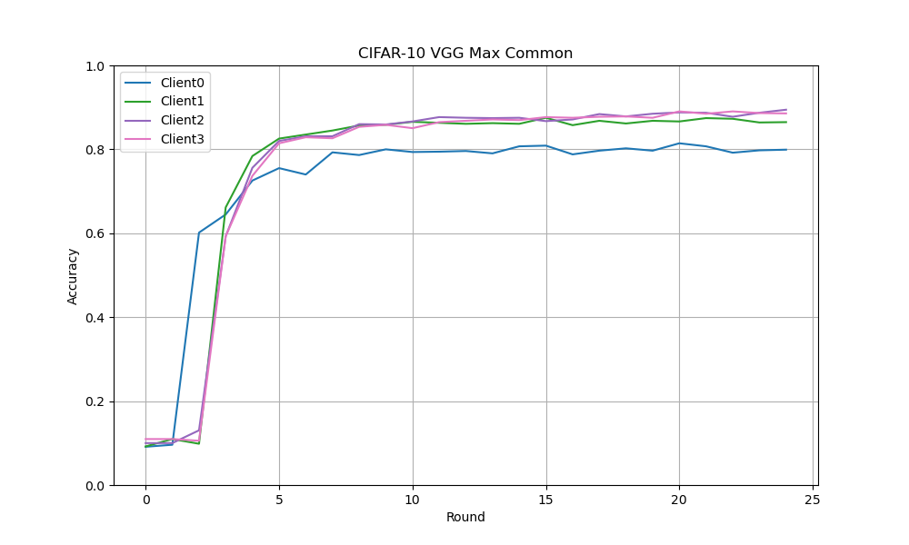
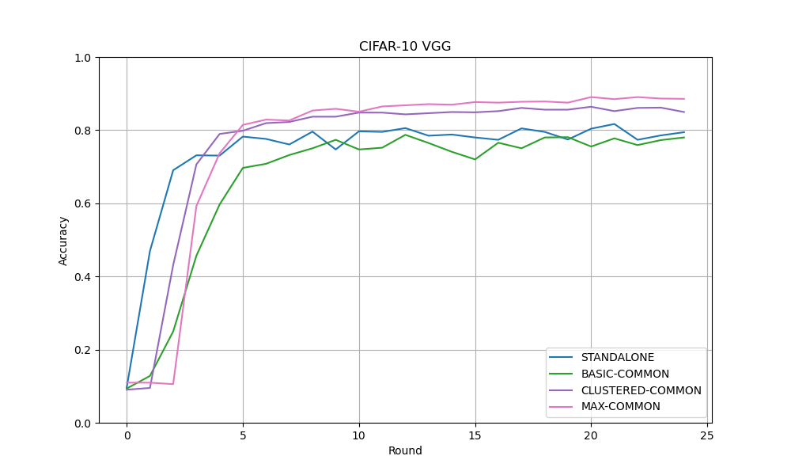

# FlexiFed 论文复现

## 任务说明

请阅读我们团队前不久刚发表的论文FlexiFed: Personalized Federated Learning for Edge Clients with Heterogeneous Model
Architectures，尝试理解全文，不要使用论文中提供的GitHub上的源代码，自主实现FlexiFed，并复现Table 1中呈现的实验结果：

第一阶段：实现FlexiFed中的三种策略，包括Basic-Common，Clustered-Common和Max-Common，复现在FlexiFed框架中用CIFAR-10数据集训练VGG模型获得的结果。
第二阶段：在完成第二阶段的基础上，复现在FlexiFed框架中用CINIC-10和Speech Commands数据集分别训练VGG模型获得的结果。
第三阶段：在完成第三阶段的基础上，复现在FlexiFed框架中用CIFAR-10，CINIC-10和Speech Commands数据集分别训练ResNet模型获得的结果。
第四阶段：在完成第三阶段的基础上，复现在FlexiFed框架中用AG NEWS数据集训练CharCNN和VDCNN模型获得的结果。

## 论文主要内容

这篇论文主要提出一种在边缘计算环境下进行联邦学习的方案FlexiFed，这种方法可以很好的适应边缘设备之间的差异性，
并且经过实验表明，该方案能够提高模型的正确率。

FlexiFed主要有以下几种策略：

- **Basic Common:** 这种策略只关注不同模型之间相同的前几层，模型经过本地训练后，只聚合这些层。
- **Clustered Common:** 这种策略在上面所述的Basic Common的基础上，对剩下的不同的层进行聚类，并在每个聚类中采用FedAvg的方式进行聚合工作。
- **Max Common:** 这种策略会递归的寻找不同模型之间相同的层，并将它们进行聚合。

几种方案的示意图如下所示：

因为本项目着重于对于论文的复现工作，针对论文中的其他细节，这里就不再展开，下面的篇幅将着重于论文的复现。

## 数据集与模型

- **CIFAR-10:** VGG-[11, 13, 16, 19], ResNet-[20, 32, 44, 56]
- **CINIC-10:** VGG-[11, 13, 16, 19], ResNet-[20, 32, 44, 56]
- **AG NEWS:** CharCNN-[3, 4, 5, 6], VDCNN-[9, 17, 29, 49]
- **Speech Commands:** VGG-[11, 13, 16, 19], ResNet-[20, 32, 44, 56]

## 环境

- Python 3.10
- Pytorch 2.0.1
- CUDA
- MPS

## 配置

- Ubuntu 22.04 LTS, Intel i5, 16 GB Memory, RTX 3050
- MacOS Sonoma 14.0, Apple Silicon M1, 8GB Memory

## 工程介绍

- main.py - 工程的入口
- partition.py - 数据集划分的相关函数
- train.py - 用于调度FlexiFed方案
- strategy.py - 实现FlexiFed的几种不同方案
- utils.py - 程序中用到的一些工具函数
- plot.py - 用于绘制图形
- model/ - 存放所用到的模型

## 代码实现

### 模型

本论文中所使用到的模型均为经典模型，为了不重复造轮子，直接使用GitHub开源的Pytorch版模型实现，这里就不再赘述。

### 数据集划分

`partition.py`中的split_iid函数作用为将数据集做平均划分，并且保证这些划分是i.i.d.（即独立同分布）的。

这个函数首先生成一个与数据集长度相同大小的下表数组，然后将这个数组打乱，再将这个数组进行划分，然后使用torch提供的Subset函数将相应的数据集的子集划分出来。

### 本地训练

`utils.py`中的train_model函数作用为对本地模型进行训练，使用SGD优化器。根据论文，每次本地训练应进行十轮，再将参数传递给中央服务器进行聚合。

test_model函数作用为测试指定模型，返回测试集上的正确率。

### FlexiFed方案的实现

复现这篇论文的重点在于复现论文中所提到的三种策略，相关代码在`strategy.py`文件中。

#### Basic Common

Basic Common是最基础的一个策略，首先需要先寻找所有模型之间共有的层，这个是通过名为get_common_layers的函数实现的。然后，需要将这些层的参数进行聚合，即求取平均值，对各个本地模型进行修改。

#### Clustered Common

该策略在上述Basic Common策略的基础上，多了聚类的工作，只需要先调用上面编写的basic_common函数，然后再分别在每个组中使用FedAvg进行聚类即可。

#### Max Common

该策略比较复杂，需要对模型的参数递归的进行分组与寻找共有层，但如果采用递归的方式编写的话，代码会比较冗长，并且递归方式对于资源的占用也比较大。

经过观察思考发现，该算法可以被改成非递归的方式进行执行，其本质上就是一个模型两两之间无顺序组合，然后寻找这两个模型之间相同的层并进行聚合的过程。

实际代码实现时，采用两重循环模拟组合抽取的过程，然后比较所抽取的两个模型之间相同的层，将相同的层的参数进行加和。另外，需要一个除数数组，该数组与模型参数数组结构相同，维护的是某个参数被加和了几次，方便后续求取平均值使用。

## 实验验证

由于时间原因，截止编写这个报告时，我只训练出了CIFAR-10在VGG模型下的数据。

另外，由于我使用的设备配置并不是很强，我选择了客户端数量为8，因为这是满足论文要求的最低数量（需要四个组，每组至少两个才能满足论文中的所有策略）。即便如此，每个单独策略的训练时间都超过了8个小时。

这个项目所实现的方案对于不同数据集和模型是通用的，所以另外的实验将在后续进行，数据将会在做完实验后更新上来。

### CIFAR-10 on VGG

每轮本地运行10次，一共运行了26轮，数据如下（只取每组中一个Client）：

#### Standalone

#### Basic Common

#### Clustered Common

#### Max Common

#### 策略之间比较

VGG-19模型在不同策略下的训练曲线，可以看出Max Common策略相对于其他策略，能够显著增加模型的正确率。

#### 汇总

| VGG              | -11     | -13     | -16     | -19     |
|------------------|---------|---------|---------|---------|
| Standalone       | 0.73744 | 0.80416 | 0.7904  | 0.76096 |
| Basic Common     | 0.73792 | 0.79056 | 0.7696  | 0.76592 |
| Clustered Common | 0.8152  | 0.8552  | 0.85056 | 0.8528  |
| Max Common       | 0.80976 | 0.88208 | 0.88336 | 0.88928 |

## 相关问题

- Q1: 为什么我的模型训练结果准确率比论文中高了不少？是因为使用了batch normal优化的问题吗？但不使用这个优化，模型不收敛。